# FORKDRIFT — CrossPoint Reader Fork

  <strong>An experimental, modular firmware fork for the <a href="https://xteink.com">Xteink X4</a> e-ink reader.</strong> 
  Tracks <a href="https://github.com/crosspoint-reader/crosspoint-reader">upstream CrossPoint</a>, absorbs the best of <a href="https://github.com/uxjulia/CrossInk">CrossInk</a>, and adds new features on top.

  <a href="https://unintendedsideeffects.github.io/ForkDrift-crosspointReader/configurator/"><strong>→ Open the ForkDrift Configurator</strong></a>

---

> **Experimental.** Many features are a work in progress and not everything is guaranteed to work at all times. We track upstream commits when they merge to `main` — we do not watch upstream PRs or issues. Features are absorbed when they land.

---

## Screens

### Home — Choose your theme

<table>
  <tr>
    <td align="center">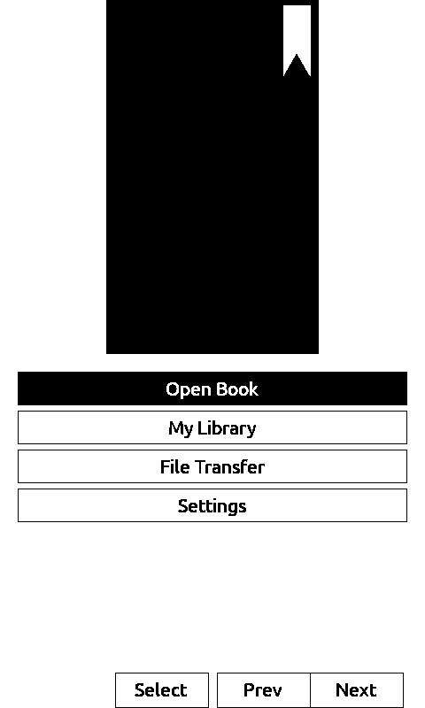 <b>Classic</b></td>
    <td align="center">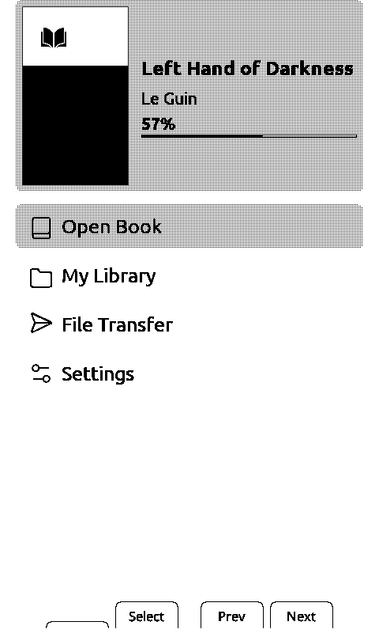 <b>Lyra</b></td>
    <td align="center">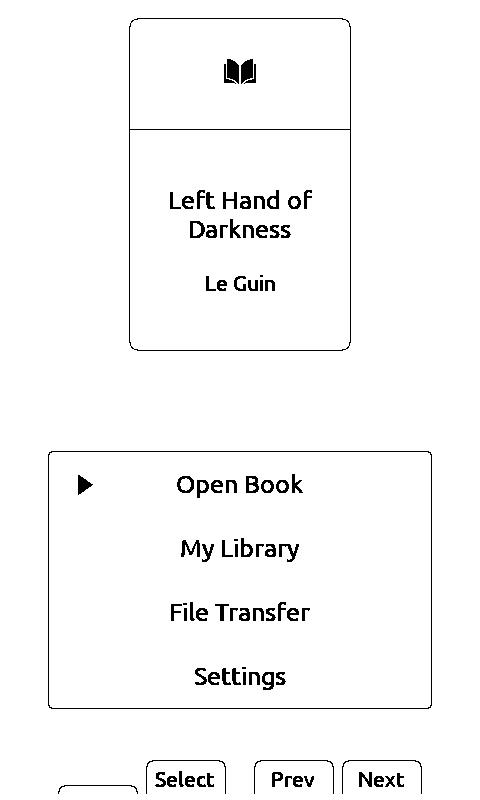 <b>Minimal</b></td>
  </tr>
  <tr>
    <td align="center">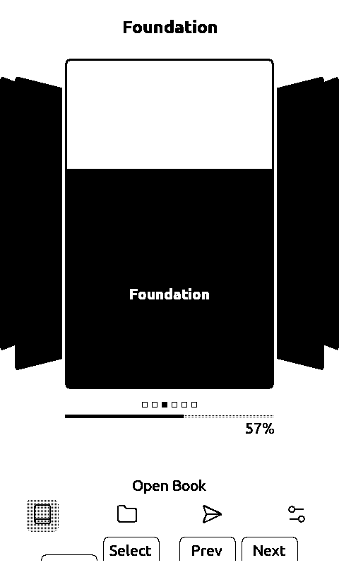 <b>Lyra Carousel</b></td>
    <td align="center">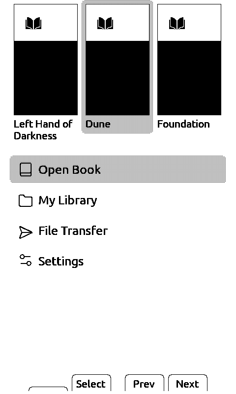 <b>Lyra Extended</b></td>
    <td align="center">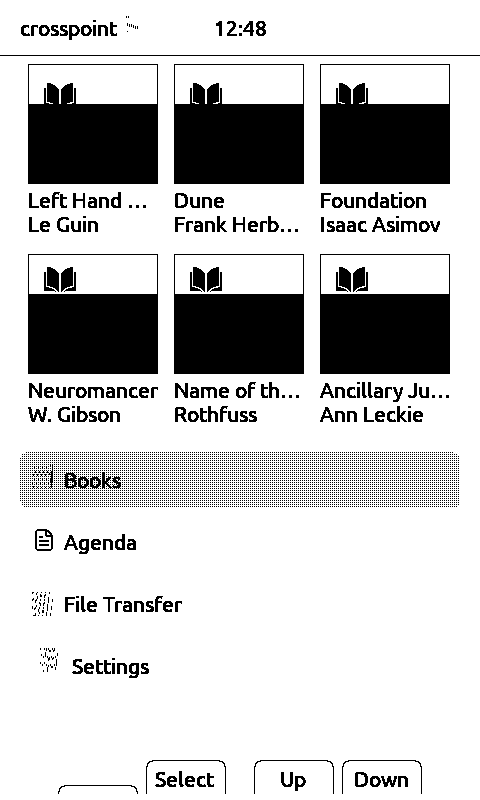 <b>Fork Drift ★</b></td>
    <td align="center">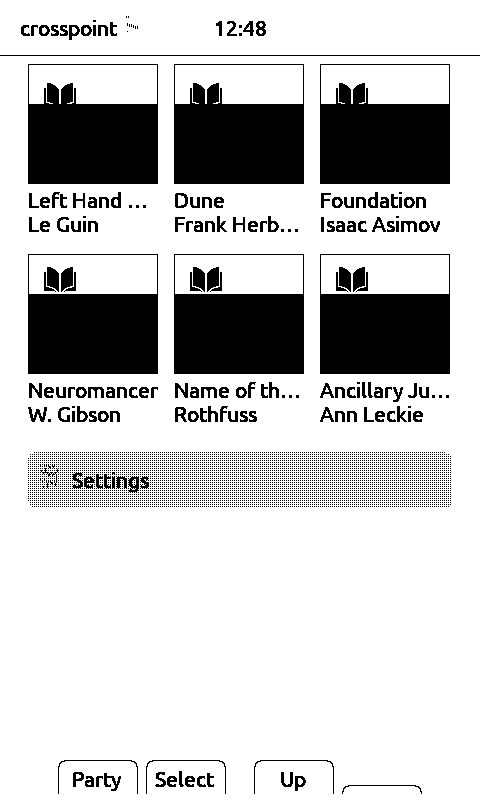 <b>Pokémon Party ★</b></td>
  </tr>
</table>

★ ForkDrift exclusive

### Reader

  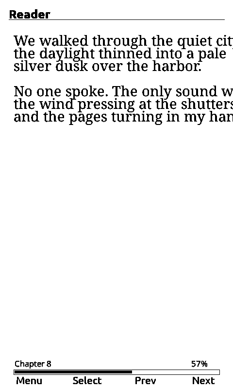

Clean reading view with the status bar showing chapter, progress bar, and page percentage. Font, size, margins, alignment, and hyphenation are all adjustable without leaving the book.

### Sleep Screens

<table>
  <tr>
    <td align="center">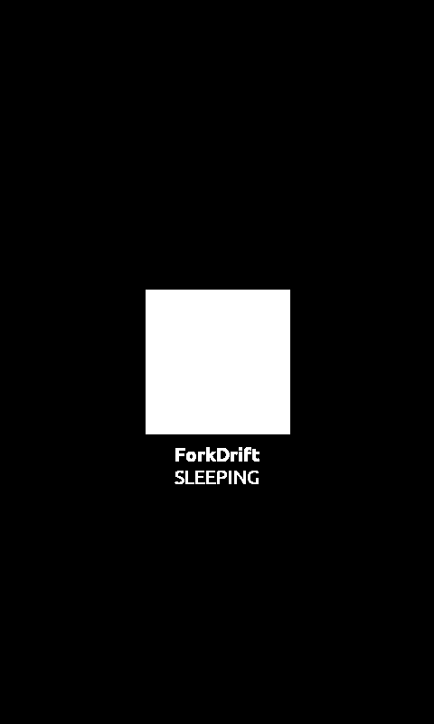 <b>Dark (default)</b></td>
    <td align="center">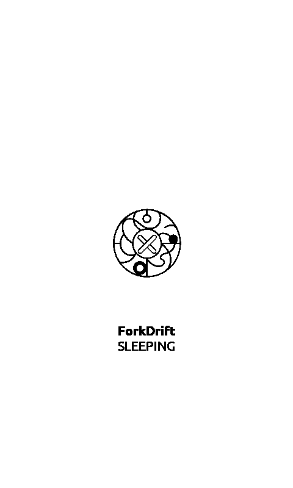 <b>Light</b></td>
    <td align="center">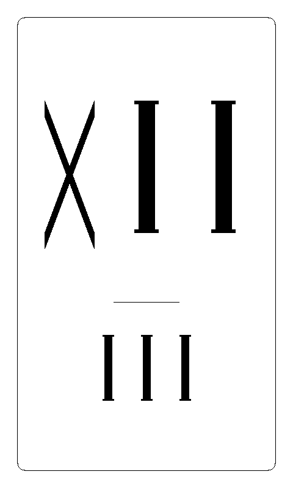 <b>Roman Clock ★</b></td>
    <td align="center">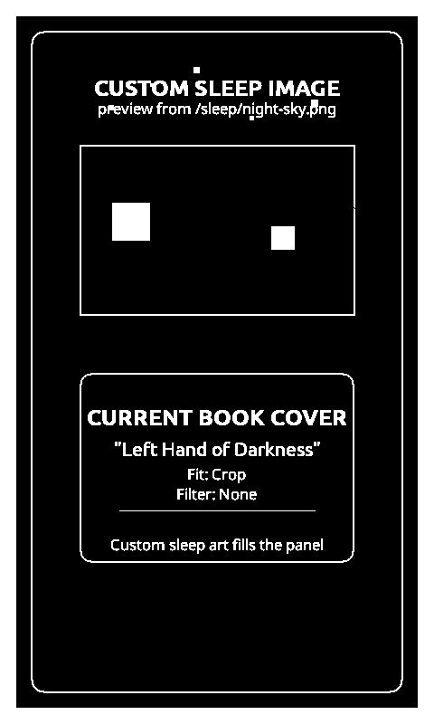 <b>Custom image</b></td>
  </tr>
</table>

★ ForkDrift exclusive · Additional compile-time modes: Reading Stats sleep screen, Roman Clock (requires WiFi Clock). Smart mode uses book covers and pinned images without a separate Cover setting.

---

## Feature List vs [Upstream](https://github.com/crosspoint-reader/crosspoint-reader)/[CrossInk](https://github.com/uxjulia/CrossInk)

Legend: ✅ present · ❌ absent · ⚙️ compile-time flag (off by default)

### Themes & UI

| Feature | Upstream | CrossInk | ForkDrift |
|---|---|---|---|
| Classic theme | ✅ | ✅ | ✅ |
| Lyra theme (rounded elements, menu icons) | ✅ | ✅ | ✅ |
| Lyra Extended theme | ✅ | ❌ | ✅ |
| Minimal theme | ❌ | ✅ | ✅ |
| Visual Covers home layout (3-book grid) | ❌ | ❌ | ✅ (Lyra Extended theme) |
| Fork Drift home layout (6-book grid) | ❌ | ❌ | ✅ |
| Dark mode | ✅ | ✅ | ✅ |
| Global status bar (battery, time, progress modes) | ✅ | ✅ | ✅ |
| Status bar: hide battery % in reader / always | ❌ | ❌ | ✅ |
| Sunlight fading fix (white model software fix) | ✅ | ✅ | ✅ |

### Fonts

| Feature | Upstream | CrossInk | ForkDrift |
|---|---|---|---|
| Noto Serif | ✅ | ✅ | ✅ |
| Noto Sans | ✅ | ✅ | ✅ |
| OpenDyslexic | ✅ | ✅ | ✅ |
| Bookerly | ❌ | ❌ | ⚙️ |
| Bitter | ❌ | ✅ | ⚙️ |
| Lexend Deca | ❌ | ✅ | ⚙️ |
| CharEInk | ❌ | ✅ | ⚙️ |
| Extra font size steps (XL, etc.) | ❌ | ✅ | ✅ |
| User font install (custom fonts from SD/web) | ✅ | ✅ | ✅ |

### Reading Experience

| Feature | Upstream | CrossInk | ForkDrift |
|---|---|---|---|
| EPUB reading | ✅ | ✅ | ✅ |
| XTC format | ✅ | ✅ | ✅ |
| TXT reader | ✅ | ✅ | ✅ |
| Markdown reader | ❌ | ❌ | ✅ |
| Hyphenation engine | ✅ | ✅ | ✅ |
| Table of contents / chapter selection | ✅ | ✅ | ✅ |
| Percent-jump navigation | ✅ | ✅ | ✅ |
| Embedded CSS/HTML styling | ✅ | ✅ | ✅ |
| Inline book images | ✅ | ✅ | ✅ |
| Text anti-aliasing | ✅ | ✅ | ✅ |
| Footnote viewer | ✅ | ✅ | ✅ |
| Auto page turn (customizable interval) | ✅ | ✅ | ✅ |
| Tilt page turn (X3 only) | ✅ | ✅ | ❌ |
| Long-press chapter skip / page scroll toggle | ❌ | ✅ | ✅ |
| Focus reading mode | ✅ | ✅ | ✅ |
| Bionic Reading mode | ❌ | ✅ | ✅ |
| Guide Dots mode | ❌ | ✅ | ✅ |
| Reading statistics (per-book + global) | ❌ | ✅ | ⚙️ |
| KOReader progress sync | ✅ | ✅ | ✅ |
| Anki flashcard integration | ❌ | ❌ | ⚙️ |

### Library & Navigation

| Feature | Upstream | CrossInk | ForkDrift |
|---|---|---|---|
| File browser | ✅ | ✅ | ✅ |
| File deletion from browser | ✅ | ✅ | ✅ |
| Hidden files toggle | ✅ | ✅ | ✅ |
| Recent books list | ✅ | ✅ | ✅ |
| Recent books grid view | ❌ | ✅ | ✅ |
| Bookmarks | ❌ | ✅ | ✅ |
| "Finished" book marking + auto-move to /Read | ❌ | ✅ | ✅ |
| OPDS catalog browser (up to 8 saved servers) | ✅ | ✅ | ✅ |
| Pokémon wallpaper companion plugin | ✅ | ✅ | ✅ |
| Pokémon Party companion | ❌ | ❌ | ✅ |
| Todo / planner | ❌ | ❌ | ✅ |
| Quick notes / scratch pad | ❌ | ❌ | ✅ |

### Connectivity & Transfer

| Feature | Upstream | CrossInk | ForkDrift |
|---|---|---|---|
| WiFi setup (saved networks) | ✅ | ✅ | ✅ |
| Web file transfer (drag-and-drop upload) | ✅ | ✅ | ✅ |
| WebDAV file access | ✅ | ✅ | ✅ |
| AP / hotspot mode with QR code | ✅ | ✅ | ✅ |
| Calibre wireless send-to-device | ✅ | ✅ | ✅ |
| Calibre content server sync | ✅ | ✅ | ✅ |
| Web settings UI (WiFi + OPDS via browser) | ✅ | ✅ | ✅ |
| Background web server (always-on) | ❌ | ❌ | ✅ |
| BLE WiFi provisioning | ❌ | ❌ | ✅ |
| USB mass storage | ❌ | ❌ | ✅ |
| Remote control (virtual button injection over WiFi/USB) | ❌ | ❌ | ✅ |
| Remote keyboard input | ❌ | ❌ | ✅ |
| WiFi clock (NTP sync) | ❌ | ❌ | ✅ |
| OTA firmware updates | ✅ | ✅ | ✅ |
| SD card firmware update | ❌ | ❌ | ✅ |

### Sleep Screen

| Feature | Upstream | CrossInk | ForkDrift |
|---|---|---|---|
| Dark / Light logo sleep screen | ✅ | ✅ | ✅ |
| Custom BMP image(s) from SD card | ✅ | ✅ | ✅ |
| Sleep image pinning (pin a specific image as default) | ❌ | ✅ | ✅ |
| Reading stats as sleep screen | ❌ | ✅ | ⚙️ |
| Book cover sleep screen (fit / crop modes) | ❌ | ✅ | ⚙️ |
| Cover + Custom fallback mode | ❌ | ✅ | ⚙️ |
| Cover filter options (none / contrast / inverted) | ❌ | ✅ | ⚙️ |
| Roman numeral clock sleep screen | ❌ | ❌ | ⚙️ |
| PNG/JPEG sleep images (not just BMP) | ❌ | ❌ | ✅ |

### Controls & Settings

| Feature | Upstream | CrossInk | ForkDrift |
|---|---|---|---|
| Button remapping (front 4 buttons) | ✅ | ✅ | ✅ |
| Side button swap (reader) | ✅ | ✅ | ✅ |
| Short power-button action (sleep / page turn / select) | ✅ | ✅ | ✅ |
| Screenshot (power+vol-down, or reader menu) | ✅ | ✅ | ✅ |
| Language / i18n support (24 languages) | ✅ | ✅ | ✅ |
| Per-orientation layout | ✅ | ✅ | ✅ |
| Modular compile-time feature flags (`ENABLE_*`) | ❌ | ❌ | ✅ |
| ForkDrift web configurator (choose features, build online) | ❌ | ❌ | ✅ |

---

# SHOUTOUTS
CrossPoint Reader is **not affiliated with Xteink or any manufacturer of the X4 hardware**.

Huge shoutout to [**diy-esp32-epub-reader** by atomic14](https://github.com/atomic14/diy-esp32-epub-reader), which was a project I took a lot of inspiration from as I
was making CrossPoint.

Shoutout also to [**BOOX-Pokedex-Wallpaper-Generator** by m86-tech](https://github.com/m86-tech/BOOX-Pokedex-Wallpaper-Generator),
the upstream project behind CrossPoint's Pokedex companion plugin. Go check it out if you want Pokédex wallpapers on
any E-Ink device — it supports Boox, Remarkable, Kindle, Kobo, and more.

---

## Sibling fork

Many features in this fork are absorbed from [**CrossInk** by uxjulia](https://github.com/uxjulia/CrossInk),
a sibling personal fork of CrossPoint Reader. Themes (Lyra Carousel, Minimal), extra font sizes, reader
controls, and reading-UX improvements originate there — go give it a look.

---

## Build & documentation

| Topic | Location |
|-------|----------|
| Monorepo build wrapper | [BUILD.md](../BUILD.md) — `./build-firmware.sh`, `./build-firmware.sh standard`, `./build-firmware.sh full` |
| Feature flags & profiles | [docs/BUILD_CONFIGURATION.md](./docs/BUILD_CONFIGURATION.md) |
| ForkDrift Configurator | https://unintendedsideeffects.github.io/ForkDrift-crosspointReader/configurator/ |
| Contributing | [docs/contributing/README.md](./docs/contributing/README.md) |
| User guide | [USER_GUIDE.md](./USER_GUIDE.md) |
| Web server & API | [docs/webserver.md](./docs/webserver.md), [docs/webserver-endpoints.md](./docs/webserver-endpoints.md) |
