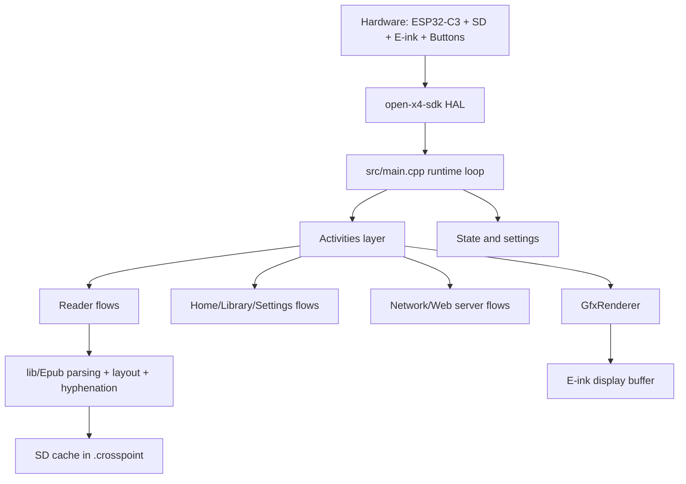
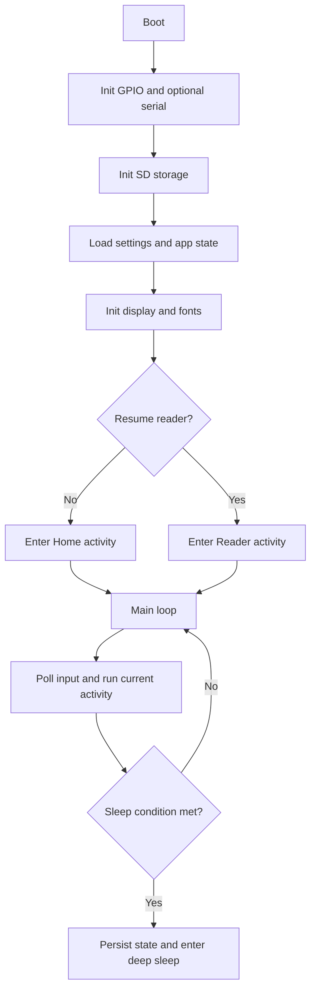
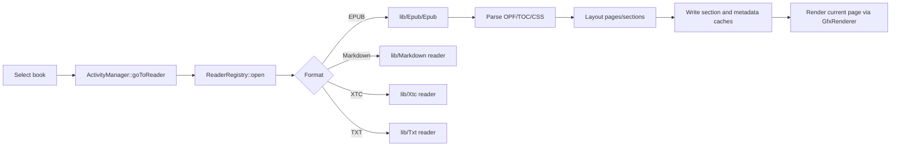
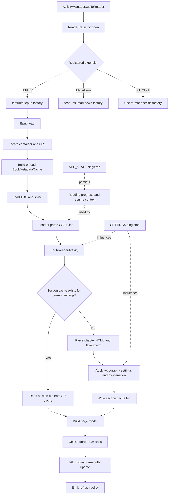

# Architecture Overview

CrossPoint is firmware for the Xteink X4 (unaffiliated with Xteink), built with PlatformIO targeting the ESP32-C3 microcontroller.

At a high level, it is firmware that uses an activity-driven application architecture loop with persistent settings/state, SD-card-first caching, and a rendering pipeline optimized for e-ink constraints.

## System at a glance



## Runtime lifecycle

Primary entry point is `src/main.cpp`.



In each loop iteration, the firmware updates input, runs the active activity, handles auto-sleep/power behavior, and applies a short delay policy to balance responsiveness and power.

## Activity model

Activities are screen-level controllers deriving from `src/activities/Activity.h`.
Some flows use `src/activities/ActivityWithSubactivity.h` to host nested activities.

- `onEnter()` and `onExit()` manage setup/teardown
- `loop()` handles per-frame behavior
- `skipLoopDelay()` and `preventAutoSleep()` are used by long-running flows (for example web server mode)

Top-level activity groups:

- `src/activities/home/`: home and library navigation
- `src/activities/reader/`: EPUB/XTC/TXT reading flows
- `src/activities/settings/`: settings menus and configuration
- `src/activities/network/`: WiFi selection, AP/STA mode, file transfer server
- `src/activities/boot_sleep/`: boot and sleep transitions

## Core Registries

The firmware utilizes a registry-based system in `src/core/registries/` to manage extensibility:

- **ReaderRegistry**: Handles registration of different document readers (EPUB, TXT, etc.).
- **WebRouteRegistry**: Manages endpoints for the internal web server.
- **HomeActionRegistry**: Defines actions available from the home screen.
- **LifecycleRegistry**: Hooks into the boot, sleep, and wake cycles.
- **SyncServiceRegistry**: Manages background synchronization services (e.g., Anki, KOReader).
- **SettingsActionRegistry**: Registers custom actions for the settings menu.
- **FeatureCatalog**: Discovery mechanism for compile-time enabled features and their metadata.

## Feature Modules

Modular functionality is organized in `src/features/`. There are currently 22 feature modules, each encapsulating specific logic (e.g., `anki`, `koreader_sync`, `ota_updates`, `usb_mass_storage`). These modules often interact with the core registries to extend system behavior.

## HAL Layer

The Hardware Abstraction Layer (HAL) resides in `lib/hal/` and provides a consistent interface for hardware-specific operations:

- **HalDisplay**: Low-level e-ink display control and buffering.
- **HalGPIO**: Button input and LED management.
- **HalPowerManager**: Battery monitoring and deep sleep control.
- **HalStorage**: Thread-safe SD card and filesystem access.
- **HalSystem**: Basic system utilities (heap/stack monitoring).

## Activity Lifecycle

Activities (derived from `Activity.h`) manage the application state and UI. The core lifecycle methods are:

- **`onEnter()`**: Called when the activity is pushed onto the stack. Use for initialization.
- **`loop()`**: Called once per main loop iteration. Handle input and state updates here.
- **`onExit()`**: Called when the activity is popped from the stack. Use for cleanup.

## Core Singletons

The following singletons provide global access to system-wide state and services:

- **`SETTINGS`**: `CrossPointSettings` instance for user preferences.
- **`APP_STATE`**: `CrossPointState` instance for persistent session data.
- **`GUI`**: Current `UITheme` and theme metrics (via `src/components/UITheme.h`).
- **`Storage`**: `HalStorage` instance for filesystem operations.
- **`I18N`**: `I18n` instance for localized string lookup (via `tr()` macro).

## Reader and content pipeline

Reader orchestration starts in `ActivityManager::goToReader()` and dispatches through `ReaderRegistry::open()`.
See [[Project State Machine]] / `docs/project-state-machine.md` for the full project state machine and current registry-based reader flow.
EPUB processing is implemented in `lib/Epub/`.



Why caching matters:

- RAM is limited on ESP32-C3, so expensive parsed/layout data is persisted to SD
- repeat opens/page navigation can reuse cached data instead of full reparsing

## Reader internals call graph

This diagram zooms into the EPUB path to show the main control and data flow from activity entry to on-screen draw.



Notes:

- "section cache exists" depends on cache-busting parameters such as font and layout-related settings
- rendering favors reusing precomputed layout data to keep page turns responsive on constrained hardware
- progress/session state is persisted so the reader can reopen at the last position after reboot/sleep

## State and persistence

Two singletons are central:

- `src/CrossPointSettings.h` (`SETTINGS`): user preferences and behavior flags
- `src/CrossPointState.h` (`APP_STATE`): runtime/session state such as current book and sleep context

Typical persisted areas on SD:

```text
/.crosspoint/
  epub_<hash>/
    book.bin
    progress.bin
    cover.bmp
    sections/*.bin
  settings.bin
  state.bin
```

For binary cache formats, see `docs/file-formats.md`.

## Networking architecture

Network file transfer is controlled by `src/activities/network/CrossPointWebServerActivity.h` and served by `src/network/CrossPointWebServer.h`.

Modes:

- STA: join existing WiFi network
- AP: create hotspot

Server behavior:

- HTTP server on port 80
- WebSocket upload server on port 81
- file operations backed by SD storage
- activity requests faster loop responsiveness while server is running

Endpoint reference: `docs/webserver-endpoints.md`.

## Build-time generated assets

Some sources are generated and should not be edited manually.

- `scripts/build_html.py` generates `src/network/html/*.generated.h` from HTML files
- `scripts/generate_hyphenation_trie.py` generates hyphenation headers under `lib/Epub/Epub/hyphenation/generated/`

When editing related source assets, regenerate via normal build steps/scripts.

## Key directories

- `src/`: app orchestration, settings/state, and activity implementations
- `src/network/`: web server and OTA/update networking
- `src/components/`: theming and shared UI components
- `lib/Epub/`: EPUB parser, layout, CSS handling, and hyphenation
- `lib/`: supporting libraries (fonts, text, filesystem helpers, etc.)
- `open-x4-sdk/`: hardware SDK submodule (display, input, storage, battery)
- `docs/`: user and technical documentation

## Embedded constraints that shape design

- constrained RAM drives SD-first caching and careful allocations
- e-ink refresh cost drives render/update batching choices
- main loop responsiveness matters for input, power handling, and watchdog safety
- background/network flows must cooperate with sleep and loop timing logic

## Scope guardrails

Before implementing larger ideas, check:

- [SCOPE.md](../../SCOPE.md)
- [GOVERNANCE.md](../../GOVERNANCE.md)
