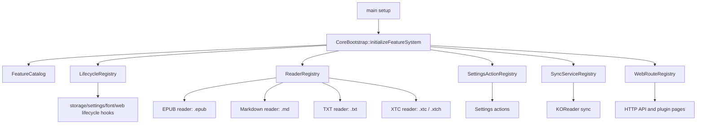

# Project State Machine

## Runtime State Machine

```mermaid
stateDiagram-v2
    [*] --> Boot

    Boot --> CrashReport: previous reset was panic
    Boot --> StorageReady: normal boot
    CrashReport --> Home: report dismissed

    StorageReady --> FeatureBootstrap: CoreBootstrap::initializeFeatureSystem()
    FeatureBootstrap --> SettingsLoaded: SETTINGS + APP_STATE loaded
    SettingsLoaded --> UsbMassStorage: USB mass storage session requested
    SettingsLoaded --> ResumeDecision: normal interactive boot

    UsbMassStorage --> Reboot: USB session exits
    Reboot --> [*]

    ResumeDecision --> ResumeReader: lastSleepFromReader && openBook exists
    ResumeDecision --> Home: no resumable reader
    ResumeReader --> ReaderOpen: ActivityManager::goToReader(APP_STATE.openEpubPath)

    Home --> Library: My Library / file browser
    Home --> RecentBooks: recent books
    Home --> ContinueReading: continue reading
    Home --> Settings: settings
    Home --> Network: web server / Wi-Fi flows
    Home --> Notes: notes
    Home --> TodoPlanner: todo feature enabled
    Home --> Sleep: idle / power action

    ContinueReading --> ReaderOpen: ActivityManager::goToReader(path)
    Library --> ReaderOpen: selected supported document
    RecentBooks --> ReaderOpen: selected recent document

    ReaderOpen --> ReaderRegistry: ReaderRegistry::open(path)
    ReaderRegistry --> UnsupportedFormat: no registered extension
    ReaderRegistry --> FeatureUnavailable: feature disabled
    ReaderRegistry --> LoadFailed: factory returns nullptr
    ReaderRegistry --> ReaderActivity: factory returns Activity*

    UnsupportedFormat --> Home
    FeatureUnavailable --> Home
    LoadFailed --> Home

    ReaderActivity --> EpubReader: .epub
    ReaderActivity --> MarkdownReader: .md
    ReaderActivity --> TxtReader: .txt
    ReaderActivity --> XtcReader: .xtc / .xtch

    EpubReader --> Reading
    MarkdownReader --> Reading
    TxtReader --> Reading
    XtcReader --> Reading

    Reading --> Library: short Back / reader callback
    Reading --> Home: long Back / home callback
    Reading --> Sleep: power action or idle
    Reading --> ReaderSubactivity: menu / TOC / sync / QR / footnotes
    ReaderSubactivity --> Reading: return

    Network --> WebServer
    Network --> CalibreConnect
    Network --> WifiSelection
    WebServer --> Home
    CalibreConnect --> Home
    WifiSelection --> Home

    Settings --> OtaUpdate
    Settings --> ClearCache
    Settings --> FactoryReset
    Settings --> ButtonRemap
    Settings --> LanguageSelect
    Settings --> Home

    OtaUpdate --> FirmwareDownload
    FirmwareDownload --> FirmwareApply
    FirmwareApply --> Reboot
    ClearCache --> Settings
    ButtonRemap --> Settings
    LanguageSelect --> Settings
    FactoryReset --> Reboot

    Notes --> Home
    TodoPlanner --> Home

    Sleep --> Wake
    Wake --> ResumeDecision
```

## Reader Registry Sub-State

```mermaid
stateDiagram-v2
    [*] --> GoToReader: ActivityManager::goToReader(path)
    GoToReader --> OpenRequest: ReaderRegistry::open(path, renderer, mappedInput, callbacks)

    OpenRequest --> FindEntry: match extension
    FindEntry --> Unsupported: no entry
    FindEntry --> SupportCheck: entry found

    SupportCheck --> FeatureUnavailable: isSupported(path) == false
    SupportCheck --> CreateActivity: supported
    CreateActivity --> LoadFailed: create(...) == nullptr
    CreateActivity --> Opened: create(...) returns Activity*

    Opened --> ReplaceActivity: ActivityManager::replaceActivity(activity)
    ReplaceActivity --> ReaderOnEnter: Activity::onEnter()

    ReaderOnEnter --> EpubReaderActivity
    ReaderOnEnter --> MarkdownReaderActivity
    ReaderOnEnter --> TxtReaderActivity
    ReaderOnEnter --> XtcReaderActivity

    Unsupported --> [*]
    FeatureUnavailable --> [*]
    LoadFailed --> [*]
    EpubReaderActivity --> [*]
    MarkdownReaderActivity --> [*]
    TxtReaderActivity --> [*]
    XtcReaderActivity --> [*]
```

## Feature Registration



## Activity Stack And Subactivities

```mermaid
stateDiagram-v2
    [*] --> CurrentActivity

    CurrentActivity --> ReplaceActivity: ActivityManager::replaceActivity()
    ReplaceActivity --> ExitOld: old.onExit()
    ExitOld --> EnterNew: new.onEnter()
    EnterNew --> CurrentActivity

    CurrentActivity --> PushActivity: startActivityForResult()
    PushActivity --> ChildActivity
    ChildActivity --> PopActivity: finish / result
    PopActivity --> CurrentActivity: parent receives ActivityResult

    CurrentActivity --> RenderPending: requestUpdate()
    RenderPending --> RenderLock: ActivityManager render loop
    RenderLock --> CurrentActivity: activity.render()
```

> [!note]
> The old `ReaderActivity` class is not part of the runtime state machine. Current document opening is registry-driven: `ActivityManager::goToReader()` calls `ReaderRegistry::open()`, and registered feature factories create the concrete reader activities.
